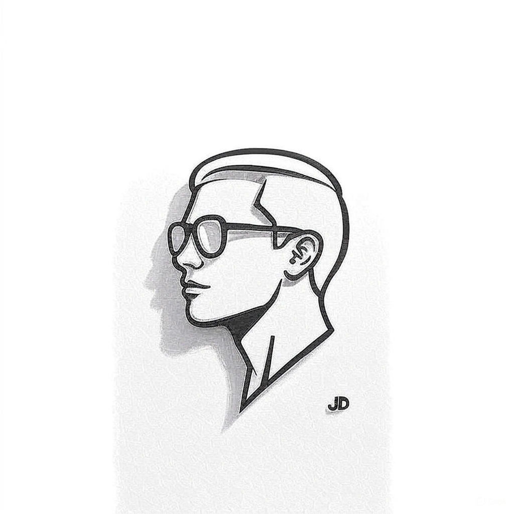

<div align="center">
  
  
  # 🚀 Modern Dev Portfolio | Tomefy5
  
  **Creative Technologist & Full-Stack Developer**
  
  [](https://nextjs.org/)
  [](https://www.typescriptlang.org/)
  [](https://tailwindcss.com/)
  [](https://www.framer.com/motion/)

  *A high-performance, visually stunning portfolio built with "Midnight Neon" aesthetics.*
</div>

---

## ✨ Features

- 🌌 **Midnight Neon Theme**: Deep dark backgrounds with cyan and purple accents.
- 🤖 **AI Chatbot**: Intelligent assistant answering questions about my projects and skills.
- 🎭 **Smooth Animations**: Powered by Framer Motion for a premium feel.
- 📐 **Responsive Design**: Flawless experience across all devices.
- ⚡ **Next.js 15 Speed**: Optimized for performance and SEO.

## 🛠️ Tech Stack

- **Framework**: Next.js 15 (App Router)
- **Language**: TypeScript
- **Styling**: Tailwind CSS
- **Animations**: Framer Motion, Lucide React
- **3D Effects**: Three.js / React Three Fiber

## 🚀 Getting Started

First, install the dependencies:

```bash
npm install
```

Then, run the development server:

```bash
npm run dev
```

Open [http://localhost:3000](http://localhost:3000) with your browser to see the result.

## 📁 Project Structure

- `app/`: Routing and API layers.
- `components/`: Modular UI sections and atomic elements.
- `lib/`: Utility functions and animation constants.
- `public/`: Static assets (images, icons).

---

<div align="center">
  Built with 💙 by Tomefy5
</div>

